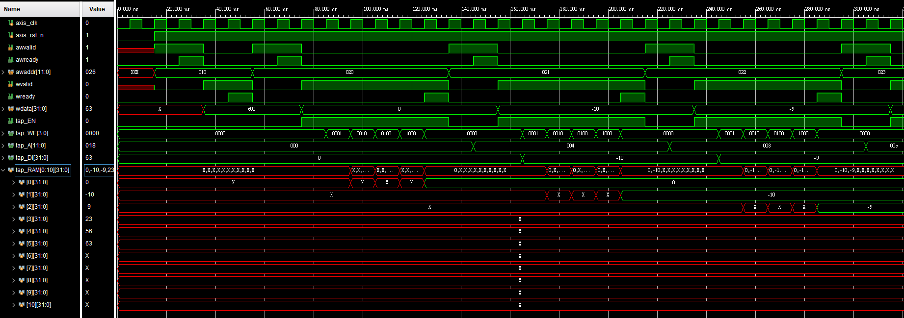
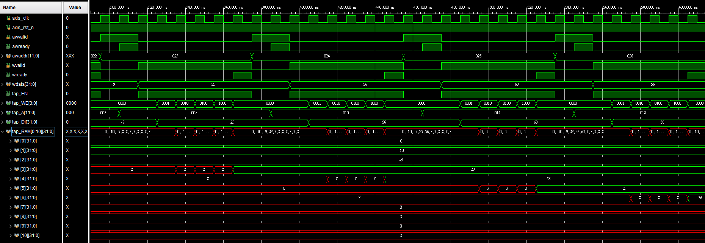
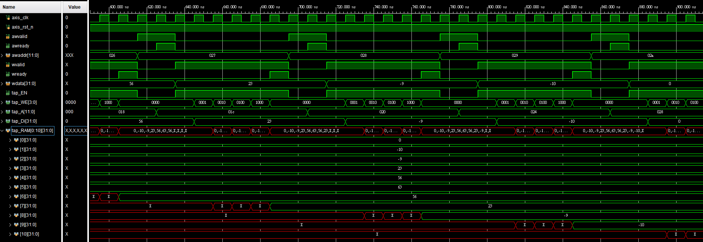
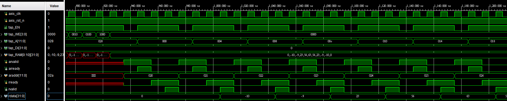
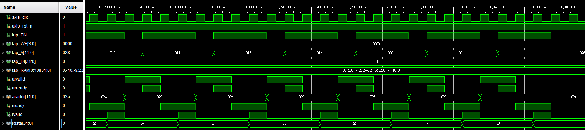
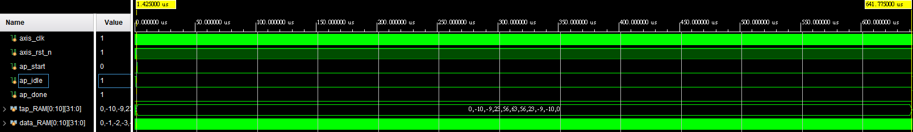
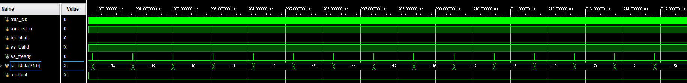
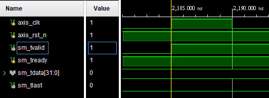
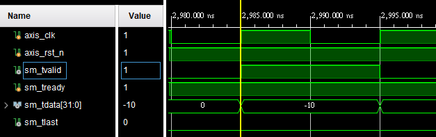

# 112_SOC_Lab
### Lab3 - FIR Filter (AXI-lite, AXI-Stream)

### Requirement
- [fir.v](./fir.v)
- [fir_tb.v](./fir_tb.v)
- [Log files](###Log_Files)
  - Synthesis
  - Simulation
  - Timing report
- [Waveform](###Waveform)
  - Configuaration write
  - ap_start, ap_done(measure # of clock cycles from ap_start to ap_done)
  - Xn stream-in, and Yn stream-out
- [Report](./report.pdf)

### Intro
> 學習兩種端口(AXI-Lite/AXI-Stream)透過verilog來實現。

### Circuit
Input: data(X[n])/coefficient(a[n])/data length/ap_start  
Process: Finite Inpulse Response(N=11)  
$$Y[n] = \sum{(a[n-11]*X[n])}$$ 
Output: data(Yn)/ap_start/ap_idle/ap_done  
Source(master) / simulation(slave)  
- Data  
    AXI-Lite(s->m): coefficient(a[n])/data length/ap_start  
    AXI-Lite(s<-m): ap_start/ap_idle/ap_done  
    AXI-Stream(s->m): data(X[n])  
    AXI-Stream(s<-m): data(Y[n])  
- Memory  
    coefficient(a[n])/data(X[n])  

### Log_Files
- [Synthesis](./log/synthesis_report.vds)
- [Simulation](./log/simulation.log)
- [Timing report](./log/timing_report.txt)
### Waveform
- Configuration write
    
    
    
    
    
- Timing
    > \# of clock cycles from ap_start to ap_done
    > period: 10 [ns]
    > Timing: 641.775[us] - 1.425[us] = 640.35 [us]
    > \# of clock cycles = 640.35 [us] / 10 [ns] = 64035 [cycles]
    
    
- Xn stream-in, and Yn stream-out
    
    
    
    
